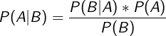
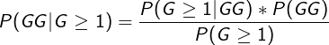
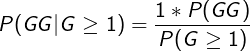
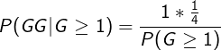
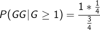
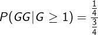
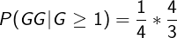
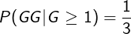

<table>
  <tr><td></td><td>Boy</td><td>Girl</td></tr>
  <tr><td>Boy</td><td>Boy-Boy</td><td>Boy-Girl</td></tr>
  <tr><td>Girl</td><td>Girl-Boy</td><td>Girl-Girl</td></tr>
</table>

<table>
  <tr><td></td><td>Boy</td><td>Girl</td></tr>
  <tr><td>Boy</td><td></td><td>Boy-Girl</td></tr>
  <tr><td>Girl</td><td>Girl-Boy</td><td>Girl-Girl</td></tr>
</table>

